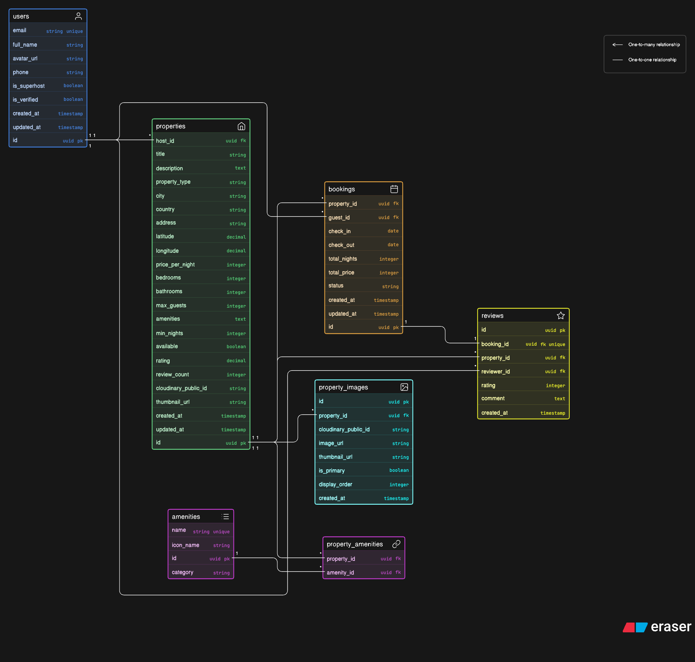

# Grihastha — Backend API

> Express.js REST API for the Grihastha Online Rental System

**Developer:** Piyush Rauniyar · Team B (Stack Rebels)

---

## Quick Start

```bash
# 1. Install dependencies
npm install

# 2. Create your environment file
cp .env.example .env
# Open .env and fill in your Supabase + Cloudinary keys

# 3. Run the server
npm run dev
# → Server running on http://localhost:5000

# 4. Test it works
curl http://localhost:5000/
# → { "status": "ok", "message": "Grihastha API is running" }
```

---

## Folder Structure

```
server/
├── config/
│   ├── supabase.js        ← Supabase admin + public client setup
│   └── cloudinary.js      ← Cloudinary config + URL helper functions
├── middleware/
│   └── auth.js            ← JWT token verification (protect, optionalProtect)
├── routes/
│   ├── auth.js            ← POST /register, /login, /logout · GET+PATCH /me
│   ├── properties.js      ← CRUD listings, host listings
│   ├── search.js          ← Search + filter + city autocomplete
│   ├── bookings.js        ← Create, view, cancel bookings
│   ├── reviews.js         ← Submit, fetch, delete reviews
│   └── upload.js          ← Cloudinary single + multiple image upload
├── index.js               ← Express app — middleware, routes, error handler
├── package.json
├── .env.example           ← Environment variable template
└── .gitignore
```

---

## Environment Variables

Copy `.env.example` to `.env` and fill in:

```env
PORT=5000
CLIENT_URL=http://localhost:3000

# Supabase → supabase.com → Project Settings → API
SUPABASE_URL=https://your-project.supabase.co
SUPABASE_ANON_KEY=your_anon_key
SUPABASE_SERVICE_KEY=your_service_role_key

# Cloudinary → cloudinary.com → Dashboard
CLOUDINARY_CLOUD_NAME=your_cloud_name
CLOUDINARY_API_KEY=your_api_key
CLOUDINARY_API_SECRET=your_api_secret
```

> ⚠️ Never commit `.env` to GitHub — it is already in `.gitignore`

---

## API Endpoints

### Auth `/api/auth`

| Method | Route | Auth | Description |
|--------|-------|------|-------------|
| POST | `/register` | Public | Create new account |
| POST | `/login` | Public | Login → returns JWT token |
| POST | `/logout` | Required | Invalidate session |
| GET | `/me` | Required | Get current user profile |
| PATCH | `/me` | Required | Update profile |

### Properties `/api/properties`

| Method | Route | Auth | Description |
|--------|-------|------|-------------|
| GET | `/` | Optional | All listings, paginated |
| GET | `/:id` | Optional | Single listing + images + reviews |
| POST | `/` | Required | Create listing |
| PATCH | `/:id` | Required | Edit own listing |
| DELETE | `/:id` | Required | Delete own listing |
| GET | `/host/my-listings` | Required | All listings by this host |

### Search `/api/search`

| Method | Route | Auth | Description |
|--------|-------|------|-------------|
| GET | `/` | Public | Filter by city, country, price, bedrooms, type |
| GET | `/suggestions` | Public | City/country autocomplete |

### Bookings `/api/bookings`

| Method | Route | Auth | Description |
|--------|-------|------|-------------|
| POST | `/` | Required | Create booking — checks date overlap |
| GET | `/my-bookings` | Required | Guest booking history |
| GET | `/host-bookings` | Required | Bookings received for host's properties |
| GET | `/:id` | Required | Single booking detail |
| PATCH | `/:id/cancel` | Required | Cancel a booking |

### Reviews `/api/reviews`

| Method | Route | Auth | Description |
|--------|-------|------|-------------|
| GET | `/property/:propertyId` | Public | All reviews for a property |
| POST | `/` | Required | Submit review (after checkout only) |
| DELETE | `/:id` | Required | Delete own review |

### Upload `/api/upload`

| Method | Route | Auth | Description |
|--------|-------|------|-------------|
| POST | `/property` | Required | Upload single image to Cloudinary |
| POST | `/multiple` | Required | Upload up to 5 images |
| DELETE | `/:publicId` | Required | Delete image from Cloudinary |

---

## Authentication

All protected routes require a Bearer token in the Authorization header:

```
Authorization: Bearer your_jwt_token_here
```

The token is returned from `POST /api/auth/login`.

---

## Database ER Diagram

<!-- PASTE YOUR ERASER.IO ER DIAGRAM SCREENSHOT BELOW THIS LINE -->


<!-- END OF ER DIAGRAM -->

To generate the diagram:
1. Go to [eraser.io](https://app.eraser.io/workspace/iuvoPXQrR55AeE1xYcjY?origin=share) → New Diagram → Entity Relationship Diagram
2. Paste the contents of `grihastha_er_schema.md`
3. Export as PNG → save to `docs/er-diagram.png`
4. Replace the placeholder above with: ``

---

## Progress Checklist

### Done ✅
- [x] `index.js` — Express app, middleware, routes, error handler
- [x] `config/supabase.js` — Supabase admin + public clients
- [x] `config/cloudinary.js` — Cloudinary config + URL helpers
- [x] `middleware/auth.js` — JWT protect + optionalProtect
- [x] `routes/auth.js` — register, login, logout, get/update profile
- [x] `routes/properties.js` — full CRUD + RLS ownership checks
- [x] `routes/search.js` — search, filter, autocomplete suggestions
- [x] `routes/bookings.js` — create, view, cancel + overlap check
- [x] `routes/reviews.js` — submit, fetch, delete + avg rating update
- [x] `routes/upload.js` — single + multiple upload + delete
- [x] `package.json` — all dependencies + nodemon dev script
- [x] `.env.example` — environment variable template
- [x] `.gitignore` — node_modules, .env excluded

### In Progress 🔄
- [ ] Fill in `.env` with real Supabase + Cloudinary credentials
- [ ] Test all endpoints in Postman
- [ ] Deploy to Render.com

### To Do 📋
- [ ] Supabase SQL — create tables with RLS policies
- [ ] Connect to frontend (Ashis + Kritik)
- [ ] API tests

---

## Dependencies

```json
{
  "@supabase/supabase-js": "^2.39.0",
  "cloudinary": "^2.0.0",
  "cors": "^2.8.5",
  "dotenv": "^16.3.1",
  "express": "^4.18.2",
  "helmet": "^7.1.0",
  "morgan": "^1.10.0",
  "multer": "^1.4.5-lts.1",
  "nodemon": "^3.0.2"
}
```

---

*Grihastha · गृहस्थ · homes with soul · Piyush Rauniyar · Team B · 2025*